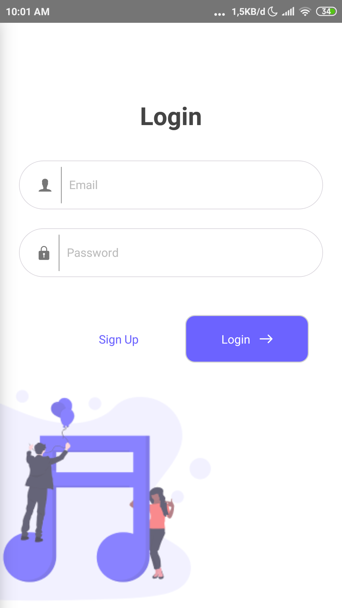
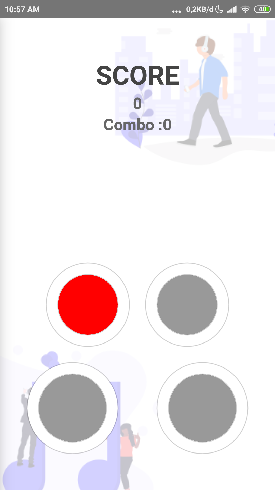
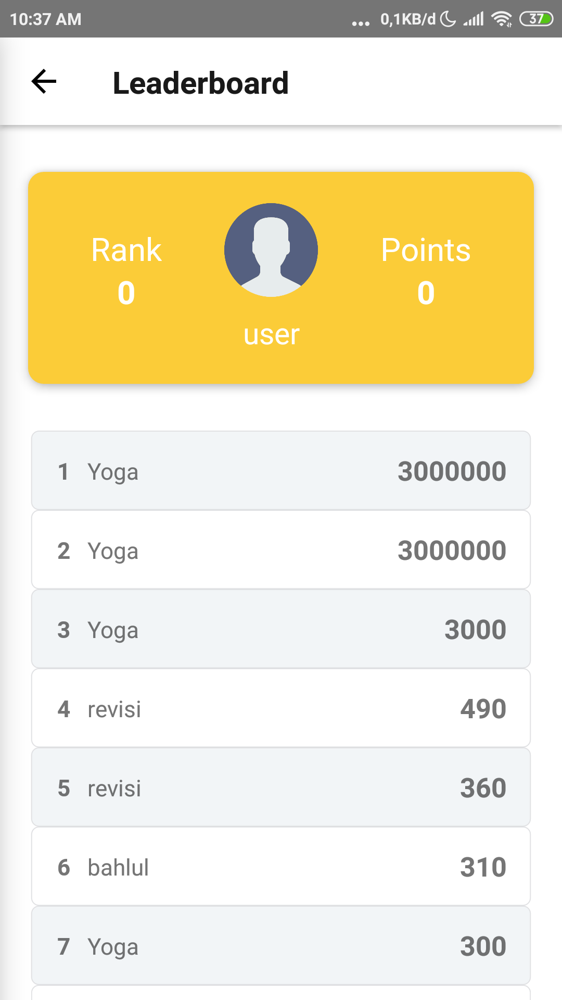

<h1 align="center">GameTab</h1>

  Built with React Native.

## Table of Contents

- [Introduction](#introduction)
- [Features](#features)
- [Requirements](#requirements)
- [Usage](#usage-for-development)
- [Screenshots](#screenshots)
- [Release APK](#release-apk)
- [Contributors](#contributors)

## Introduction
GameTab is a game of choosing a button that lights up according to the path that has been provided to get a high score

## Features
* Different sound event press button
* Button guide
* Leaderboard
* And others

## Requirements
* [`npm`](https://www.npmjs.com/get-npm)
* [`react-native`](https://facebook.github.io/react-native/docs/getting-started)
* [`react-native-cli`](https://facebook.github.io/react-native/docs/getting-started)
* [`Database`](https://console.firebase.google.com)

## Usage For Development
1. Open your terminal
2. Copy and Paste here `git clone https://github.com/abdillahtop/Android-gameTab.git`
3. cd `Android-gameTab` type `npm install` for install dependencies and `react-native link`
4. type `react-native run-android` fork run aplikasi. ***Make sure your device is connected with debugging mode***.

## Screenshots

     
    
    

## Release APK

## Contributors

  <table>
    <tr>
      <td align="center">
        <a href="https://github.com/abdillahtop">
           
          <b>Abdillah Dzulfikar Mustanir</b>
        </a>
      </td>
    </tr>
  </table>

